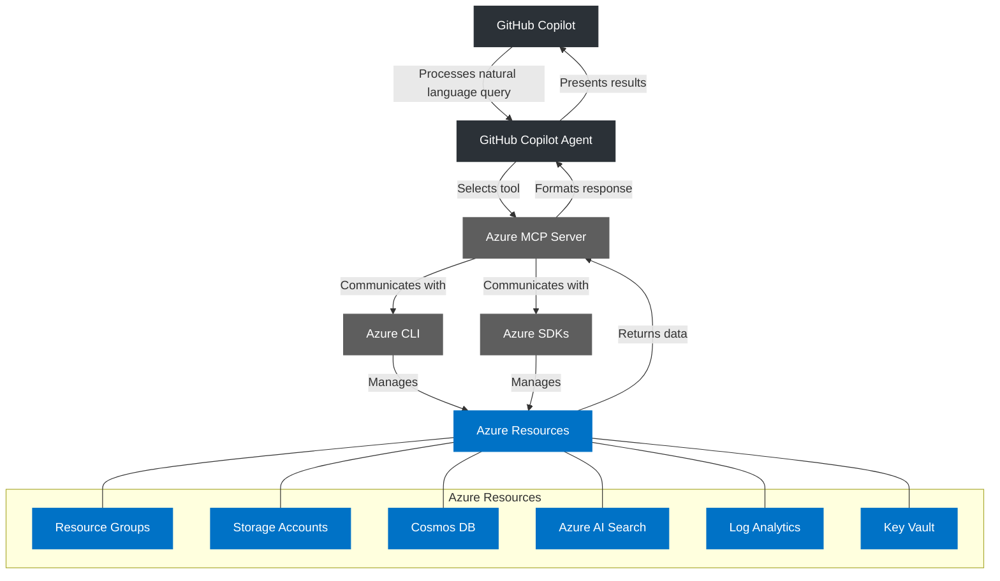

# Azure MCP and GitHub Copilot Architecture

This diagram illustrates the flow of information between GitHub Copilot, the Azure MCP Server, and Azure resources.

1. The user enters a natural language query in GitHub Copilot
2. GitHub Copilot Agent processes the query and selects Azure MCP as the appropriate tool
3. Azure MCP Server receives the command and uses Azure CLI or Azure SDKs to interact with Azure resources
4. Azure resources return the requested data
5. Azure MCP formats the response into structured data
6. GitHub Copilot Agent presents the results to the user in a human-readable format

The architecture enables users to manage Azure resources through natural language queries without having to remember complex CLI commands or navigate through the Azure Portal.
